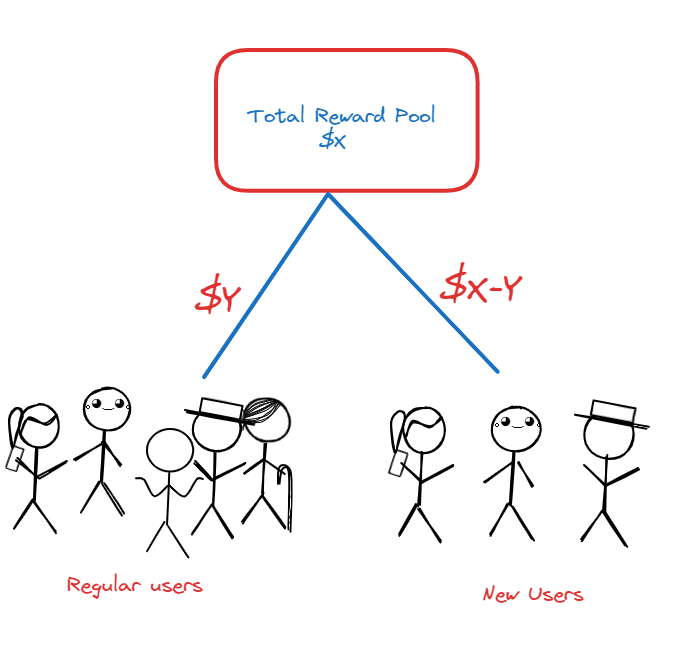

# Idea Title

### Enhanced Retention Strategy for New Users through Reward Pool Segmentation

# Overview

To address the issue of new users not staying on the StackUp platform for a long time(I believe only 1% of the total no.of users we are having are regularly doing), this idea involves splitting the total reward pool into two categories. By allocating a portion of the rewards specifically for new users, we can ensure they experience tangible benefits quickly, increasing their trust and commitment to the platform.

# Implementation Plan

### Reward Pool Segmentation:

- **Description:** Split the total reward pool **($x)** into two segments:**$y** for regular users and **$x-y** for new users. A new user is defined as someone with less than **$10** in their wallet **&&** who has not made any withdrawals.

- **Benefits:** Ensures new users receive required rewards for the first withdrawal faster, which builds trust and encourages them to stay on the platform.

### Incentivized Onboarding:

- **Description:** Offer additional small rewards or bonuses for new users upon completing initial tasks like joining our discord server and completing the onboarding process or challenges on the platform like how to join and submit a quest(I know we had these implementations earlier but I feel it should stay for a longer period)

- **Benefits:** Engages new users early and gives them a taste of the platform’s benefits, increasing the likelihood of retention.

Now we have the random reward allocation method, so this idea is inspired by that, this method can be better for new stackies for staying/ believing in our platform.

# Early Challenges

1. **Challenge:**  Our [legends](https://www.scamadviser.com/account/profile/1183659) may create multiple accounts, in the greed of earning.
**Mitigation:** We already have the model to detect the user doing suspicious activity.
2. **Challenge:** Implementing the new reward system might require significant changes to the platform's backend.
**Mitigation:** Admin Adjustment
